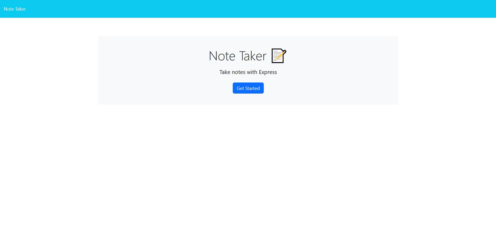

# Note-Taker-Express.js

Main Topic: Using express.js to connect the front end of our application to back end. Also successfully deploying the application to Heroku

# Short Description

This project had several goals to have a fully deployed application. First was to create the backend portion of the note taking applicatoin in which we connected the front end with the back end using express.js. Using express to save notes to a json file and then retrieving the saved notes to be displayed on the front end. Each note is also given a unique id so it can be callbacked to with the use of a filter.

The most challenging goal of this project is to ensure the pathing for our files is correct so that when our application it is uploaded to heroku/github pages/etc there are not application errors.

# Full page screenshot

# Link to deployed application

https://shielded-sands-30415.herokuapp.com/